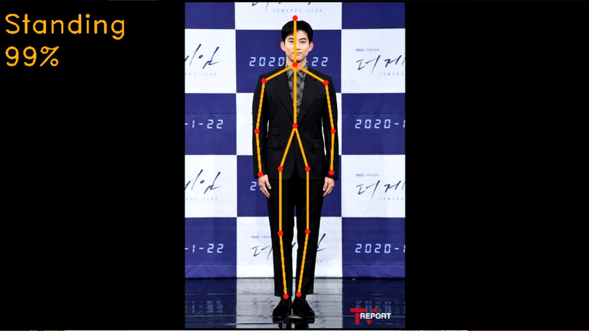
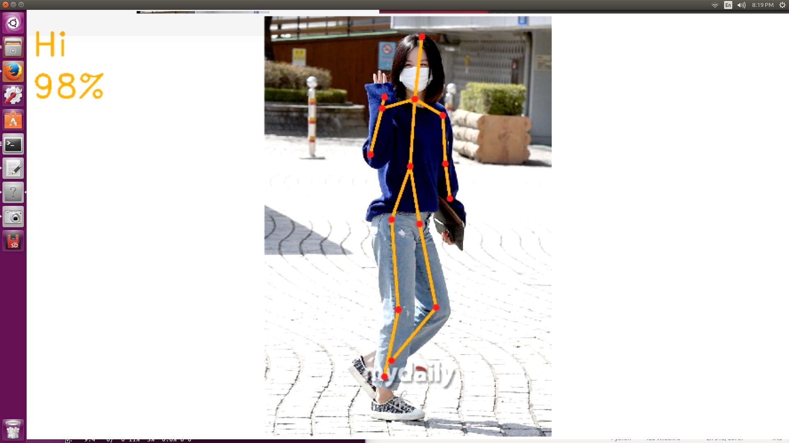

# AWS-DeepLens-Pose

## AWS 딥렌즈를 이용한 자세 인식

<p align=center></p>

## Environment

- AWS DeepLens
- python 3.7

## Train

1. You can train any posture
2. Extract posture data using [extract_pose.py](https://github.com/seoh02h/AWS-DeepLens-Pose/blob/master/extract_pose.py)
3. Train using [mxnet_train.ipynb](https://github.com/seoh02h/AWS-DeepLens-Pose/blob/master/mxnet_train.ipynb)
4. Get 'DeepLens_pose-0500.params' and 'DeepLens_pose-symbol.json'

## Openpose
[CMU-Perceptual-Computing-Lab/openpose](https://github.com/CMU-Perceptual-Computing-Lab/openpose)

[mxnet_Realtime_Multi-Person_Pose_Estimation](https://github.com/dragonfly90/mxnet_Realtime_Multi-Person_Pose_Estimation)
1. Convert openpose model to run on DeepLens
2. Get 'realtimePose.bin' and 'realtimePose.xml'

## Deploy
Reference : [deeplens-inference-lambda-create](https://github.com/awsdocs/aws-deeplens-user-guide/blob/master/doc_source/deeplens-inference-lambda-create.md)
1. Use AWS Lambda


## Project

### Live

```
python deeplens_pose_live.py
```

### Test with Images

```
python deeplens_pose_image.py
```

### Result Sample ( Test )

<p align=center></p>
<p align=center></p>

## View

### Project Streams

```
./view_deeplens_project_streams.sh
```

### Live Streams

```
./view_deeplens_live_streams.sh
```
