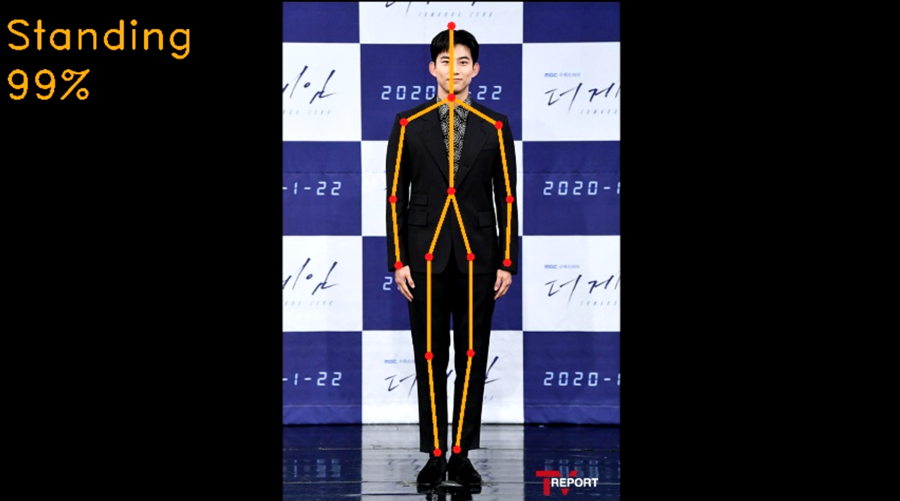
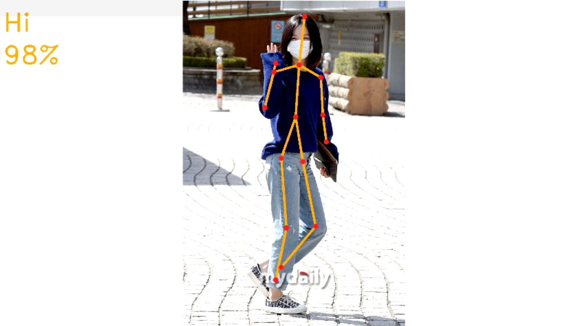

# AWS-DeepLens-Pose

## AWS 딥렌즈를 이용한 행동 인식

<p align=center></p>

## Environment

- AWS DeepLens
- python 3.7

## Train

1. Extract pose data

```
python extract_pose.py
```

2. Train using mxnet_train.ipynb
3. Get 'DeepLens_pose-0500.params' and 'DeepLens_pose-symbol.json'

## Openpose

1. Convert openpose model to run on DeepLens
2. Get 'realtimePose.bin' and 'realtimePose.xml'

## Deploy

1. Use AWS Lambda

## Project

### Live

```
python deeplens_pose_live.py
```

### Test with Images

```
python deeplens_pose_image.py
```

### Result Sample ( Test )

<p align=center></p>
<p align=center></p>

## View

### Project Streams

```
./view_deeplens_project_streams.sh
```

### Live Streams

```
./view_deeplens_live_streams.sh
```
